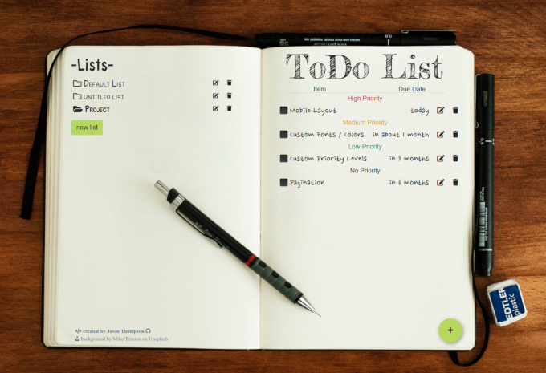

<!-- PROJECT LOGO -->
 

  

<h3 align="center">Project: ToDo List</h3>

  <a href="https://www.theodinproject.com/courses/javascript/lessons/todo-list"><strong>View the assignment »</strong></a>

 

## About

This is a project from The Odin Project's JavaScript course. 
In this project, you are asked to create a todo-list app using JavaScript.

A link to the full description of the assignment can be found above.

## Preview

## Live version

<a href="https://jasont01.github.io/todo-list">GitHub Pages</a>

## The Odin Project 

The Odin Project is a open source, full stack curriculum focused on helping you learn web development.

Learn more at their site: <a href="https://www.theodinproject.com/">theodinproject.com</a>

